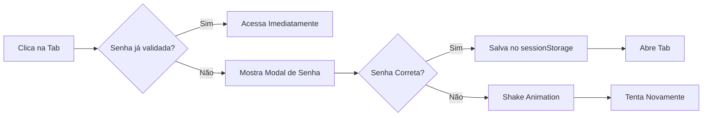

# Sistema de Proteção por Senha - Admin Panel

**Data:** 28/11/2025  
**Commit:** d9d726f  
**Status:** ✅ Implementado e Funcional

---

## 🔐 Visão Geral

Sistema simples de proteção por senha para seções sensíveis do painel admin, impedindo acesso não autorizado a áreas críticas.

### Senha de Admin
```
2005Admin
```

---

## 🎯 Seções Protegidas

### ✅ COM Senha (Requer Autenticação)

| Seção | Descrição | Ícone |
|-------|-----------|-------|
| **Empresas** | Criar, editar, deletar empresas | 🔒 |
| **Colaboradores** | Gerenciar permissões de usuários | 🔒 |
| **Gerar PDF** | Fluxo completo de geração de documentos | 🔒 |

### ❌ SEM Senha (Livre Acesso)

| Seção | Descrição | Motivo |
|-------|-----------|--------|
| **Clientes** | Adicionar/editar trabalhadores | Operação comum, baixo risco |
| **Histórico** | Visualizar documentos gerados | Apenas leitura |
| **Configurações** | Ajustes gerais do sistema | Não afeta dados críticos |

---

## 🚀 Como Funciona

### 1. Fluxo de Acesso



### 2. Validação em sessionStorage

**Chaves usadas:**
```javascript
sessionStorage.setItem('senha_empresas_validada', 'true');
sessionStorage.setItem('senha_colaboradores_validada', 'true');
sessionStorage.setItem('senha_gerarPDF_validada', 'true');
```

**Vantagens:**
- ✅ Limpa automaticamente ao fechar aba
- ✅ Não persiste entre sessões diferentes
- ✅ Perde ao dar refresh (comportamento desejado)
- ✅ Isolado por aba do navegador

### 3. Interface do Modal

**Características:**
- Fundo semi-transparente (40% opacidade)
- Pode ver conteúdo atrás do modal
- Responsivo (mobile e desktop)
- Suporte a dark mode
- Animação shake ao errar senha
- Atalhos de teclado:
  - `Enter` → Valida senha
  - `Esc` → Cancela

---

## 📱 Layout Responsivo

### Desktop (≥1024px)
```
┌─────────────────────────────────────┐
│  [Overlay transparente 40%]         │
│                                      │
│     ┌──────────────────────┐        │
│     │  🔒 Área Protegida   │        │
│     │  Digite a senha...   │        │
│     │  [_____________]     │        │
│     │  [Cancelar] [OK]     │        │
│     └──────────────────────┘        │
│                                      │
└─────────────────────────────────────┘
```

### Mobile (<768px)
```
┌────────────────┐
│ [Overlay 40%]  │
│                │
│  ┌──────────┐  │
│  │ 🔒 Senha │  │
│  │ [_______]│  │
│  │ [Cancel] │  │
│  │ [  OK  ] │  │
│  └──────────┘  │
│                │
└────────────────┘
```

---

## 🎨 Indicadores Visuais

### Ícones de Cadeado
```html
<!-- Tab protegida -->
<i class="bi bi-lock-fill text-yellow-500"></i>
```

**Localização:**
- Menu mobile: Canto direito de cada botão
- Menu desktop: Ao lado do texto da tab
- Cor: Amarelo (`text-yellow-500`) para destaque

### Estados do Modal

| Estado | Visual | Descrição |
|--------|--------|-----------|
| Normal | Borda amarela-laranja | Aguardando senha |
| Erro | Borda vermelha + shake | Senha incorreta |
| Sucesso | Fecha automaticamente | Senha aceita |

---

## 💻 Código de Implementação

### 1. Estado no Alpine.js (`admin-controller.js`)

```javascript
// Variáveis de controle
modalSenha: false,
senhaInput: '',
senhaSecaoAtual: '', // empresa | colaboradores | gerarPDF
senhaTentativaErro: false,
SENHA_ADMIN: '2005Admin',
```

### 2. Métodos Principais

#### `solicitarSenha(secao, callback)`
```javascript
/**
 * Solicita senha para acessar seção protegida
 * @param {string} secao - empresa | colaboradores | gerarPDF
 * @param {Function} callback - Função a executar após validação
 */
solicitarSenha(secao, callback) {
    // Se já validou, executa callback direto
    if (this.validarAcessoSecao(secao)) {
        callback();
        return;
    }
    
    // Mostra modal
    this.senhaSecaoAtual = secao;
    this.senhaInput = '';
    this.senhaTentativaErro = false;
    this.modalSenha = true;
    
    // Focar no input
    setTimeout(() => {
        const input = document.getElementById('senha-admin-input');
        if (input) input.focus();
    }, 100);
}
```

#### `validarSenha()`
```javascript
validarSenha() {
    if (this.senhaInput === this.SENHA_ADMIN) {
        // Salva validação
        const chave = `senha_${this.senhaSecaoAtual}_validada`;
        sessionStorage.setItem(chave, 'true');
        
        // Fecha modal e executa ação
        this.modalSenha = false;
        this.mudarAbaProtegida(this.senhaSecaoAtual);
        
    } else {
        // Senha incorreta - shake animation
        this.senhaTentativaErro = true;
        this.senhaInput = '';
        setTimeout(() => this.senhaTentativaErro = false, 2000);
    }
}
```

### 3. Uso nas Tabs

**Antes (sem proteção):**
```html
<button @click="activeTab = 'empresas'">Empresas</button>
```

**Depois (com proteção):**
```html
<button @click="solicitarSenha('empresas', () => activeTab = 'empresas')">
    <i class="bi bi-building"></i> Empresas
    <i class="bi bi-lock-fill text-yellow-500"></i>
</button>
```

---

## 🧪 Testes

### Teste 1: Primeiro Acesso à Tab Protegida
```
1. Abrir admin.html
2. Clicar em "Empresas"
3. ✅ Deve aparecer modal de senha
4. Digitar "2005Admin"
5. ✅ Deve fechar modal e abrir tab Empresas
```

### Teste 2: Segundo Acesso (Mesma Sessão)
```
1. Já validado no Teste 1
2. Clicar em "Clientes" (sem senha)
3. Voltar para "Empresas"
4. ✅ Deve abrir direto (sem pedir senha novamente)
```

### Teste 3: Senha Incorreta
```
1. Clicar em "Colaboradores"
2. Digitar "senhaerrada"
3. ✅ Input deve tremer (shake animation)
4. ✅ Mensagem de erro vermelha aparece
5. ✅ Input limpa automaticamente
6. Tentar novamente com senha correta
7. ✅ Deve funcionar
```

### Teste 4: Refresh da Página
```
1. Validar senha em "Empresas"
2. Recarregar página (F5)
3. Clicar em "Empresas" novamente
4. ✅ Deve pedir senha novamente (sessionStorage limpo)
```

### Teste 5: Cancelar Modal
```
1. Clicar em "Gerar PDF"
2. Modal aparece
3. Clicar em "Cancelar" ou pressionar ESC
4. ✅ Modal fecha
5. ✅ Tab não muda (permanece na atual)
```

### Teste 6: Enter para Validar
```
1. Clicar em tab protegida
2. Digitar senha
3. Pressionar ENTER (não clicar no botão)
4. ✅ Deve validar e abrir tab
```

### Teste 7: Dark Mode
```
1. Ativar dark mode
2. Clicar em tab protegida
3. ✅ Modal deve ter cores dark
4. ✅ Input deve ter fundo escuro
5. ✅ Mensagens devem ter cores apropriadas
```

### Teste 8: Mobile (Touch)
```
1. Abrir em mobile (ou resize para <768px)
2. Abrir menu hamburger
3. Clicar em "Empresas" ou "Gerar PDF"
4. ✅ Modal deve ocupar tamanho apropriado
5. ✅ Botões devem ter 48px+ de altura (touch-friendly)
```

---

## 🔧 Manutenção

### Alterar a Senha

**Arquivo:** `js/admin-controller.js` (linha ~74)

```javascript
SENHA_ADMIN: '2005Admin', // ← Altere aqui
```

### Adicionar Nova Seção Protegida

**1. Atualizar botão no HTML:**
```html
<button @click="solicitarSenha('nomeDaSecao', () => activeTab = 'nomeDaSecao')">
    <i class="bi bi-icon"></i> Nome da Seção
    <i class="bi bi-lock-fill text-yellow-500"></i>
</button>
```

**2. Atualizar método `mudarAbaProtegida()` no JS:**
```javascript
mudarAbaProtegida(secao) {
    switch(secao) {
        case 'empresas':
            this.activeTab = 'empresas';
            break;
        case 'nomeDaSecao': // ← Adicionar aqui
            this.activeTab = 'nomeDaSecao';
            break;
    }
}
```

### Remover Proteção de uma Seção

**Reverter para código original:**
```html
<!-- De: -->
<button @click="solicitarSenha('empresas', () => activeTab = 'empresas')">

<!-- Para: -->
<button @click="activeTab = 'empresas'">
```

---

## 🔒 Nível de Segurança

### ⚠️ Este é um Sistema SIMPLES

**O que protege:**
- ✅ Acesso não autorizado de usuários casuais
- ✅ Alterações acidentais por pessoas não treinadas
- ✅ Curiosos que têm acesso ao computador do admin

**O que NÃO protege:**
- ❌ Desenvolvedores que inspecionam o código
- ❌ Ataques sofisticados
- ❌ Acesso ao localStorage/sessionStorage via DevTools
- ❌ Requisições diretas à API do GitHub

### Recomendações para Produção

Se precisar de segurança real:

1. **Backend com autenticação JWT**
2. **Rate limiting** no servidor
3. **Hash bcrypt** para senhas
4. **2FA (Two-Factor Authentication)**
5. **Logs de auditoria**
6. **Permissões granulares** por usuário

---

## 📊 Estatísticas

**Código adicionado:**
- Linhas no JS: ~95 linhas
- Linhas no HTML: ~85 linhas (modal)
- Linhas no CSS: ~11 linhas (animação)
- **Total:** ~191 linhas

**Tempo de implementação:** ~30 minutos  
**Complexidade:** Baixa (para desenvolvimento)  
**Manutenibilidade:** Alta (código simples e direto)

---

## 📝 Notas Finais

### Comportamento Esperado
- ✅ Senha persiste **apenas durante a sessão**
- ✅ Refresh limpa todas as validações
- ✅ Fechar aba limpa automaticamente
- ✅ Múltiplas abas = validações independentes

### Melhorias Futuras (Opcional)
- [ ] Adicionar timeout automático (ex: 30 min)
- [ ] Log de tentativas de acesso
- [ ] Alertar admin após X tentativas erradas
- [ ] Permitir senha customizada via config
- [ ] Suporte a múltiplas senhas (por usuário)

---

**Desenvolvido em:** 28/11/2025  
**Versão:** 1.0.0  
**Licença:** MIT  
**Autor:** @gasparfranciscogulungo
